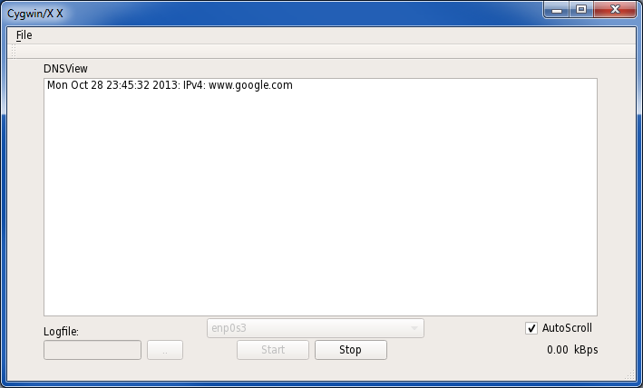

DNS Viewer
========

dns_viewer lets you view your DNS queries and log them to file.

Dependencies
---
[Qt5](http://qt-project.org/downloads)
[WinPcap](http://www.winpcap.org/devel.htm)/[libpcap](http://www.tcpdump.org/#latest-release)

Build
---
$ cd build
$ cmake -DPCAP_ROOT_DIR=<libpcap/WinPCap install dir> -DCMAKE_PREFIX_PATH=<Qt5 install dir/lib/cmake> ../src

Linux
---
$ make
$ make package

Windows 
---
$ msbuild PACKAGE.vcxproj /p:Configuration=Release /p:Platform=<platform>

